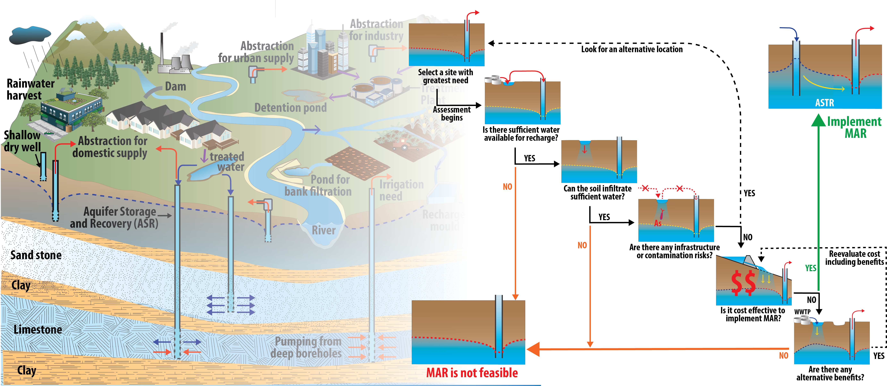

## Processing Codes accompanying the publication: 
### Alam, S., Borthakur, A., Ravi, S., Gebremichael, M., Mohanty S.K. (2021). Managed aquifer recharge implementation criteria to achieve water sustainability. Science of The Total Environment, 768, p.144992, https://doi.org/10.1016/j.scitotenv.2021.144992

THE Codes IS PROVIDED "AS IS", WITHOUT WARRANTY OF ANY KIND, EXPRESS OR IMPLIED, INCLUDING BUT NOT LIMITED TO THE WARRANTIES OF MERCHANTABILITY, FITNESS FOR A PARTICULAR PURPOSE AND NONINFRINGEMENT. IN NO EVENT SHALL THE AUTHORS OR COPYRIGHT HOLDERS BE LIABLE FOR ANY CLAIM, DAMAGES OR OTHER LIABILITY, WHETHER IN AN ACTION OF CONTRACT, TORT OR OTHERWISE, ARISING FROM, OUT OF OR IN CONNECTION WITH THE SOFTWARE OR THE USE OR OTHER DEALINGS IN THE SOFTWARE.

* Author: Sarfaraz Alam (szalam@stanford.edu), Stanford Univ Dept of Geophysics 
* Date: 2/2022
* Description: This repository contains the code and data related to the analysis of worldwide Managed Aquifer Recharge practices and their climate, soil type, influent, and effluent types. The study also reviewed how MAR impacts water quality. 

  
Managed Aquifer Recharge types

## More information about data used or queried in this repository can be found in the manuscript text.

## Soil map: Global Hydrologic Soil Groups
[HYSOGs250m](https://daac.ornl.gov/cgi-bin/dsviewer.pl?ds_id=1566)

## Coordinates of MAR sites: MAR portal
[MAR portal](https://apps.geodan.nl/igrac/ggis-viewer/viewer/globalmar/public/default)

## Basin shapefile
[Hydrosheds](https://www.hydrosheds.org/page/hydrobasins)

## Precpitation
[Tropical Rainfall Measuring Mission (TRMM)](https://gpm.nasa.gov/missions/trmm)

## Evapotranspiration (ET)
[Global Land Evaporation Amsterdam Model (GLEAM)](https://www.gleam.eu/)

## Gravity Recovery and Climate Experiment (GRACE)
[GRACE](https://podaac.jpl.nasa.gov/datasetlist?ids=Collections:ProcessingLevel&values=GRACE-FO:*3*&search=%22GRACE-FO%22&view=list)
